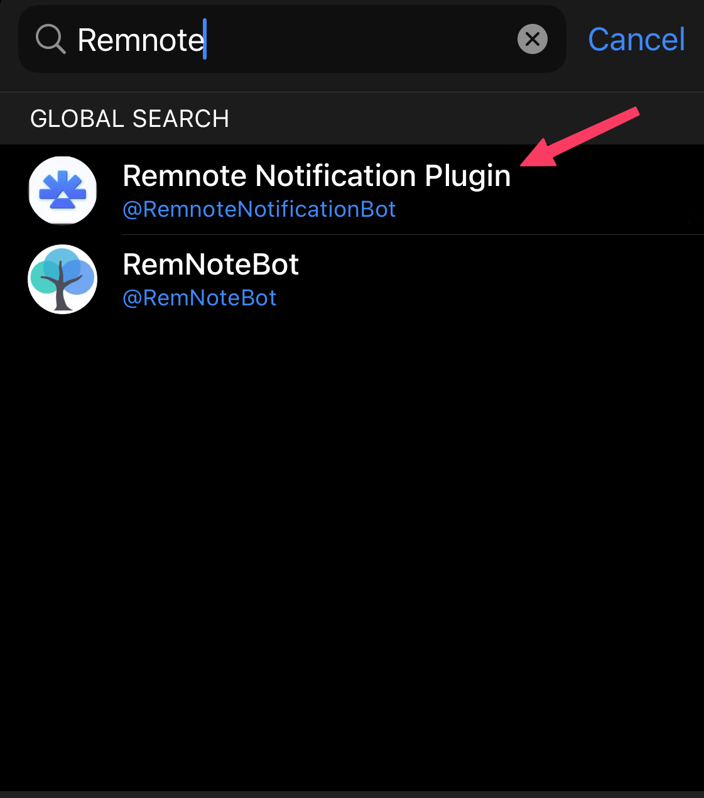
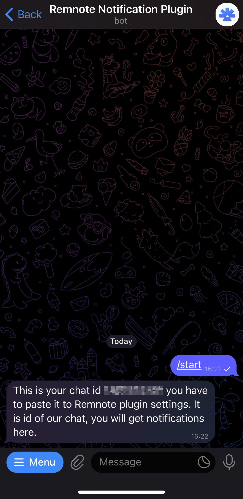
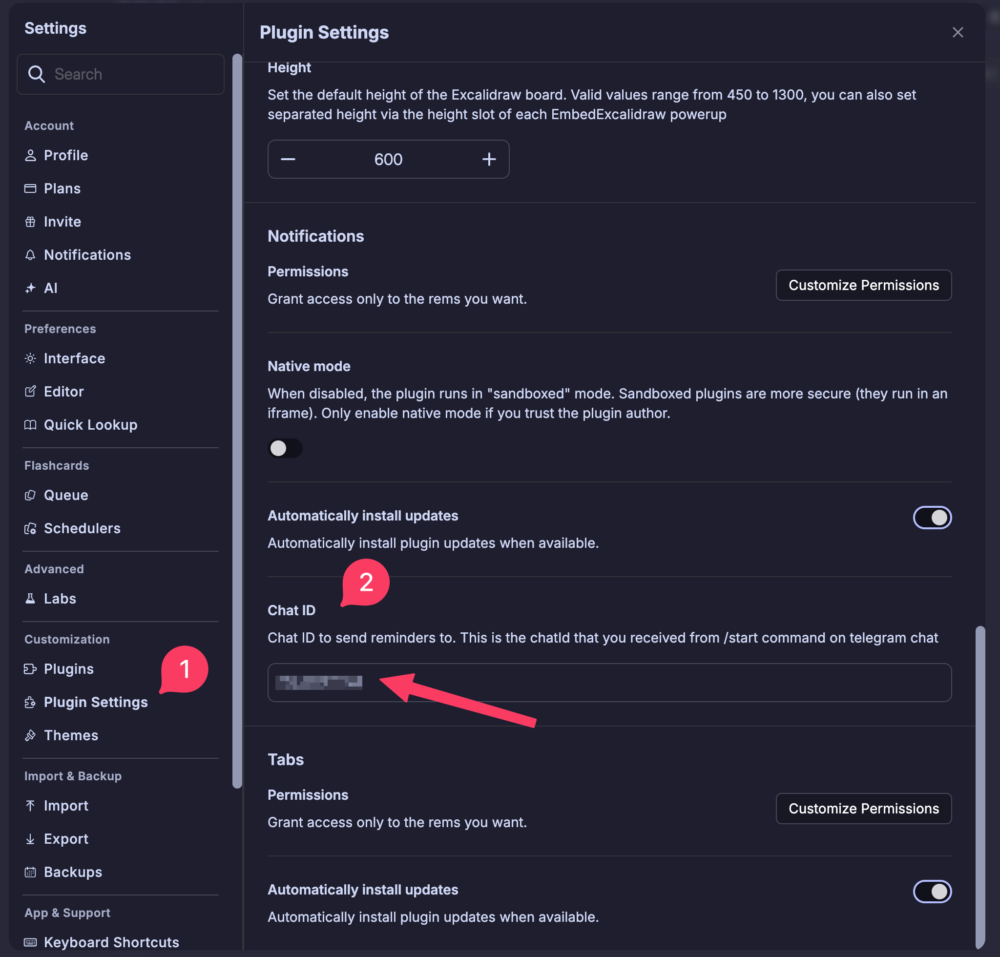
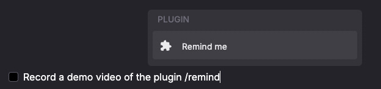
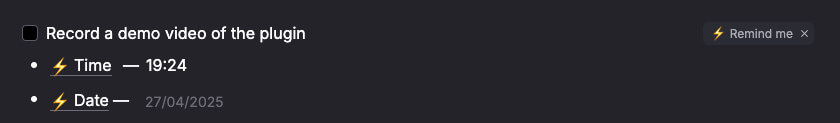

# ⚠️ Alpha Version – For Testers Only

> This is a **Reminders Plugin** that lets you set reminders using the `/remind me` command. You’ll receive a message at the specific time you choose.

---

## 🔧 Installation

1. **Open the Telegram app.**
2. **Search for** `Remnote Notification Plugin`.

   

3. **Open the chat** and tap the **Start** button or type `/start`.  
   This will display your **Chat ID** – copy it.

   

4. **Paste the Chat ID into the plugin settings.**

   

5. You're all set!  
   Now you can create reminders using the `/remind me` command.

     
   

---

## 🐞 Found a Bug or Have Feedback?

👉 [Open the Feedback Form](https://tally.so/r/3qgQyg)

---

<small>version: alfa-1</small>
