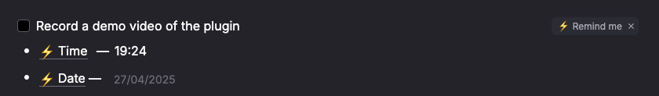

# 🛎️ RemNote Reminders Plugin

Organize your workflow and never miss a thing again!  
**RemNote Reminders** lets you easily set personal reminders inside RemNote, and delivers them straight to you via Telegram.

---

## ✨ Features

- #️⃣ **Add a Single Reminder** — Create a reminder for any Rem with one click.
- 🧩 **Add Multiple Reminders** — Select multiple lines and add reminders for each one at once.
- 🔗 **Direct Links** — Every reminder message you receive contains a **direct link** to the specific Rem inside your RemNote.

---

## 🔐 Privacy First

Your data is safe:

- Reminders are stored on our server **only as long as the Rem has the "remind me" powerup** in RemNote.
- When you remove the "remind me" tag from a Rem, the reminder **is instantly deleted** from the server.

You are always in full control over your data.

---

## 📸 Screenshots

---

## 🎥 Demo Video

<!-- Insert demo video link or embed -->

---

## 🚀 Start Getting Reminders Now!

Stay organized, stay on track, and let RemNote Reminders handle the follow-ups for you!  
Set it up once, and let the reminders come to you — exactly when you need them.

---

## 🛠️ Configuration

// TBD
